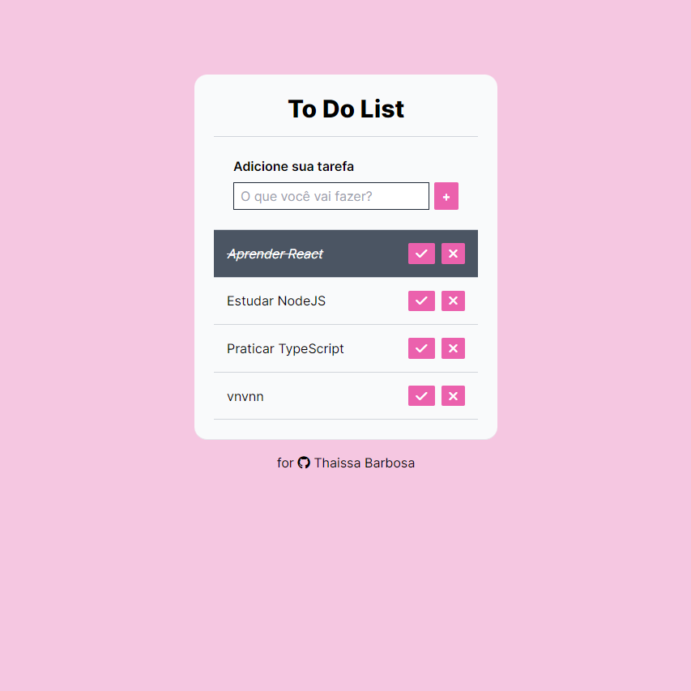

**<h1 align="center">To Do List</h1>**

> Project Status: completed :heavy_check_mark:


## Topics

:small_blue_diamond: [Layout](#-layout)

:small_blue_diamond: [Project Description](#-project-description)

:small_blue_diamond: [API Endpoints](#-api-endpoints)

:small_blue_diamond: [Functionalities](#-functionalities)

:small_blue_diamond: [Technologies](#-technologies)

:small_blue_diamond: [How to run the application](#how-to-run-the-application-arrow_forward)

:small_blue_diamond: [Developers](#developers-octocat)

:small_blue_diamond: [License](#memo-license)


## 🎨 **Layout**

<p aling="center">
 
</p>


## 💻 **Project Description**

<p align="justify">

**<h3>To Do List:</h3>**

 - This project consists of a web application for managing a to-do list, where users can add, mark as completed, and delete tasks. The application is composed of a React client that interacts with a Node.js API to manage the tasks.
   
</p>


## ✨ **API Endpoints**

 - **GET /tasks**: Returns all tasks.
 - **POST /tasks**: Adds a new task.
 - **PATCH /tasks/:id**: Updates an existing task.
 - **DELETE /tasks/:id**: Deletes a task.


## 🎓 **Functionalities**

*<h3>This application has:</h3>*

 - Add a new task;
 - Mark a task as completed;
 - Delete a task.


## 🧰 **Technologies**

*This project was developed with the following technologies:*

- [React.JS](https://pt-br.reactjs.org/)
- [Node.JS](https://nodejs.org/)
- [Express](https://expressjs.com/pt-br/)
- [Axios](https://axios-http.com/ptbr/docs/intro)
- [Git and Github](https://git-scm.com/)


## **How to run the application** :arrow_forward:

*In the terminal, clone the project:*

```
git clone <REPOSITORY_URL>
```

*Install client dependencies:*

```	
cd client
npm install
```

*Install server dependencies:*

```	
cd server
npm install
```	

*Start the server:*

```	
cd server
npm start
```	

*Start the client in a new terminal:*

```	
cd client
npm run dev
```	


## **Developers** :octocat:

<br>

| [<br><sub>Thaíssa Barbosa</sub>](https://github.com/BarbosaThaissa) |


## :memo: **License**

*This project is under the MIT license*

<p aling="center">
 
</p>


**Copyright :copyright: 2023 - Thaissa Barbosa**


Made with 💜 by myself : [My contact!] [contatothaissabarbosa@gmail.com]
